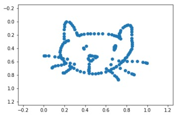
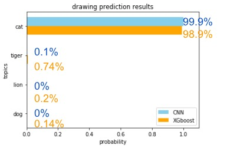
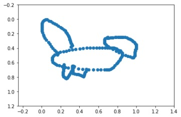
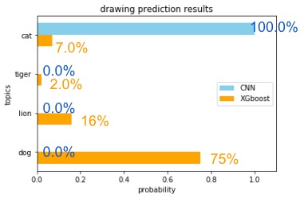
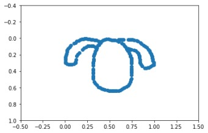
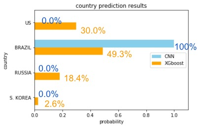

# quick,draw! prediction model
this is my repository for the quick draw prediction model project  
_last updated: 11/20/2017_  

## Repo Instructions

python folder:  
+ contains 3 python files  
  - feature_engineering_func.py:  
    + has python codes to set up json raw file into data that could be used for CNN and ensemble methods
  - CNN_func.py
    + has python codes to run CNN for image recognitions and country prediction
  - ensemble_method_func.py
    + has python codes to run XGboost ensemble method algorithm for image recognitions and country prediction
   
Procedure.ipynb  
+ Jupyter notebook that runs python codes above. note that there is no data stored in this repo.

images  
+ jpeg images used in this readme markdown file.  

## Introduction:

[Google Quickdraw](https://quickdraw.withgoogle.com/data) released dataset that contains over 50 million drawings on 5/18/2017.  
the google quickdraw is an online pictionary game application where...   
1. user is asked to draw a picture of certain category in 20 seconds    
2. While user draws a picture, google AI will try to predict what user is drawing  
3. If google AI predicts what user is drawing, user wins!  
4. repeat 1-3 6 times.  
(Of course there is no prize for winning this game but it is super addicting!)  
  
  
With this dataset, I wanted to answer following 2 questions:  
**_1. Can machine learning models distinguish similar drawings?_**  
**_2. Can machine learning models identify users' country based on their drawings?_**  
  
To answer these questions, I prepared 2 prediction models  
1. XGBoost ensemble method model  
2. Convolusional Neural Network model  
  
## Results
  
I made 4-way classifier prediction models for both image recognition and country prediction (Total of 4 models).  
  
**model Accuracy**  

|                 |  image recognition  |   Country prediction   |
|:--------------: | :------------------:|:----------------------:|
|    CNN model    |        90.2%        |           62.7%        |
|  XGBoost model  |        79.1%        |           43.8%        |  

  
  
### Results of image recognition

Example1: Cat Drawing1  

  

Example2: Cat Drawing2  

  
  
For image recognition, both CNN and XGBoost models had high prediction accuracy.  
Since CNN model looks into pixels and XGBoost model looks into features that I calculated,  
features are engineered differently for each model (meaning models analyze images completely differently).  
Therefore, they make quite different predictions. For instance, check out Example2 above.  
  
  
### Results of Country prediction
  
Example1: Dog Drawing from Brasil  



For Country prediction, models had lower accuracy than ones from image recognition.  
The important features from XGboost model indicates that users' country can be identified based on  
  
1. amount of information (details) exist within an image  
2. how fast/slow did users draw their images  
3. direction of first few strokes
4. X,Y ratio of images


## Data used:
  
the dataset that google released contains images and several features related to image.  
Features include drawing_ID, category(what quickdraw asked to draw), timestamp, whether AI guessed correct or not, user's country and drawing.  
drawing is represented as a list of list of list.  
The drawing feature is a list of strokes and stroke is a list of X,Y and time (3 lists within a stroke)  
  
the stroke information contains 2 additional dimensions:  
  
|  typical image  |   Quickdraw data   |  
|:--------------: | :-----------------:|  
| 3D (X,Y,color ) | 4D(X,Y,time,stroke)|  
|     a drawing   | how user drew a drawing|  
  
  
from this input dataset, I collected image data of **CAT**, **TIGER**, **LION**, **DOG** for image recognition part of my project.  
  
for country preiction part of my project I selected 4 countries: **United States**, **BRASIL**, **RUSSIA** and **SOUTH KOREA**.  
  
I used these 4 countries because these 4 countries had good number of images and they also do not share same alphabet/language.  
My initial guess was that the way people draw is closely related to how people write.  

------------
#### other info:

Image recognition:
+ used 120,000 drawings
  - CAT:30,000  TIGER:30,000  LION:30,000  DOG:30,000
+ drawings were selected randomly

Country prediction:
+ used total of 31,276 drawings from US, Brasil, Russia and South Korea
  - US:8000, BR:8000, RU:8000, KR:7276
+ drawings were filtered by country and selected randomly
+ drawings consists of cat, tiger, lion and dog.


## MODELS
#### Filters applied to both models  
all drawing used in training  
1. were recognized by Google AI correctly
2. contains 15 or less strokes
3. has final time that is 20000ms or less
4. has X and Y ratio where range of Y / range of X =< 1.5
  
**label:**  
image recognition:  
[cat,tiger,lion,dog]  

country prediction:  
[US, BR, RU, KR]
  
-----------------
#### 1. XGBOOST
 Ran codes that creates 399 new features.
 Features include:
 + average number of datapoints per stroke
 + total time spent on drawing
 + time per stroke
 + direction (in radian) of particular stroke
 + stroke number of the stroke with most data points etc. etc. etc.  
 
 
**image recognition model:**  
(max_depth=1, n_estimators=5000, learning_rate=0.25)  
Highest accuracy (6/27/2017): 79.1222222222 percent
  
  
**country prediction model:**  
(max_depth=1, n_estimators=1000, learning_rate=0.2)  
Highest accuracy (6/27/2017): 43.7979539642 percent  
  
-------------------------
#### 2. Convolusion Neural Network Model  
the code I have for CNN applies filtering above and reformat each image into 42 pixel(Y) by 28 pixel(X) format.  
After this process, my CNN data has 1176 columns per image.  

**CNN structure**  
+ 64 convolusion layers with kernel size 5 by 5
+ max pooling layer with pooling size 2 by 2
+ 1 layer of feed forward neural network with 100 neurons
  - relu was used for the activation function 
+ 20% dropout rate was assigned to prevent overfitting
+ final activation function = softmax
+ 4 output neurons  


**Keras parameters and codes:**  
  
```python
from keras.models import Sequential
from keras.layers import Dense, Dropout, Activation, Flatten
from keras.layers import Convolution2D, MaxPooling2D
from keras.layers.convolutional import ZeroPadding2D
from keras.utils import np_utils
from keras.models import load_model

model = Sequential()
model.add(Convolution2D(64, 5, 5, activation='relu', input_shape=(42,28,1)))
model.add(MaxPooling2D(pool_size=(2,2)))
model.add(Flatten())
model.add(Dense(100, activation='relu'))
model.add(Dropout(.20))
model.add(Dense(4, activation='softmax'))

model.compile(loss='mean_squared_error', optimizer='adam',metrics=['accuracy'])

model.fit(X_train, y_train, batch_size=128, nb_epoch=30, verbose=1,validation_split=0.2)
```
  
If you have any suggestion or have better CNN model parameters/code for google quickdraw data, let me know!


**image recognition model:**  
(batch_size = 128, epoch = 20)  
Highest accuracy (6/27/2017): 90.21666666666667 percent
  
  
**country prediction model:**  
(batch_size = 128, epoch = 30)  
Highest accuracy (6/27/2017): 62.7050053121 percent  

--------------
## Findings:  
 
From XGBoost model's feature importance attributes, found some interesting results about image recognition and country prediction.  
  
### Image recognition:  
The model distinguished images based on how much datapoints exist in first 3 strokes.  
In other words, the model looked for amount of details that exist within first 3 strokes.  
Also 4 types of images were distinguishable based on the starting point of drawing and X:Y ratio of image.  
It looked on direction (slope and direction) of stroke. Somehow, direction of stroke 6 was important when distinguishing cat, tiger, lion and dog drawings.

**XGBoost model's top10 most important features for image recognition:**  
 1. Ymax  
 2. datapoint_percentage_stroke1  
 3. datapoint_percentage_stroke2  
 4. X_0  
 5. direction_stroke6  
 6. datapoint_percentage_stroke0  
 7. direction_stroke1  
 8. direction_stroke2  
 9. total_time_drawing  
 10. Y_0  
   
  
### Country prediction:  
In order to distinguish user's country, my XGBoost model looked on certain characteristics of images.  
  
1. amount of information (details) exist within an image  
2. how fast/slow did users draw their images  
3. direction of first few strokes
4. X,Y ratio of images

number 3 brings up interesting point since [Quartz.com](https://qz.com/994486/the-way-you-draw-circles-says-a-lot-about-you/) had an article on quickdraw with similar data analysis result.  
Both article and my results showed that diffrent culture/country tends to draw certain shape/objects differently due to their method of writing.


**XGBoost model's top10 most important features for country prediction:**  
 1. total_number_of_datapoints  
 2. time_stroke0  
 3. direction_stroke2  
 4. X_0  
 5. time_1  
 6. ave_datapoints_per_stroke  
 7. direction_stroke0  
 8. direction_stroke3  
 9. final_time  
 10. Ymax  
 
all features on this list had above 1% feature importance

## What's next?  
- work on XGboost model with more pictures and countries.  
  * test XGboost results with countries with similar cultural backgrounds, same languages and geographic locations.  
    - What would the result look like if I run country prediction with US, UK, AU, NZ? or South American countries?  
- Organize and write cleaner code.  
  * accessing into images stored as a "list of lists of lists" is really painful. Since I need to create new features from the contents of this nested list, I would like to find a way to code computationally faster and cleaner.  

## Other:  
**project presentation video DSI capstone project showcase Galvanize Austin 6/22/2017**  
[](https://www.youtube.com/watch?v=dA4LeDK251A)
   
## Resources:  
1. [Quick,Draw! The Data](https://quickdraw.withgoogle.com/data) 

2. [How do you draw a circle? We analyzed 100,000 drawings to show how culture shapes our instincts](https://qz.com/994486/the-way-you-draw-circles-says-a-lot-about-you/) 
